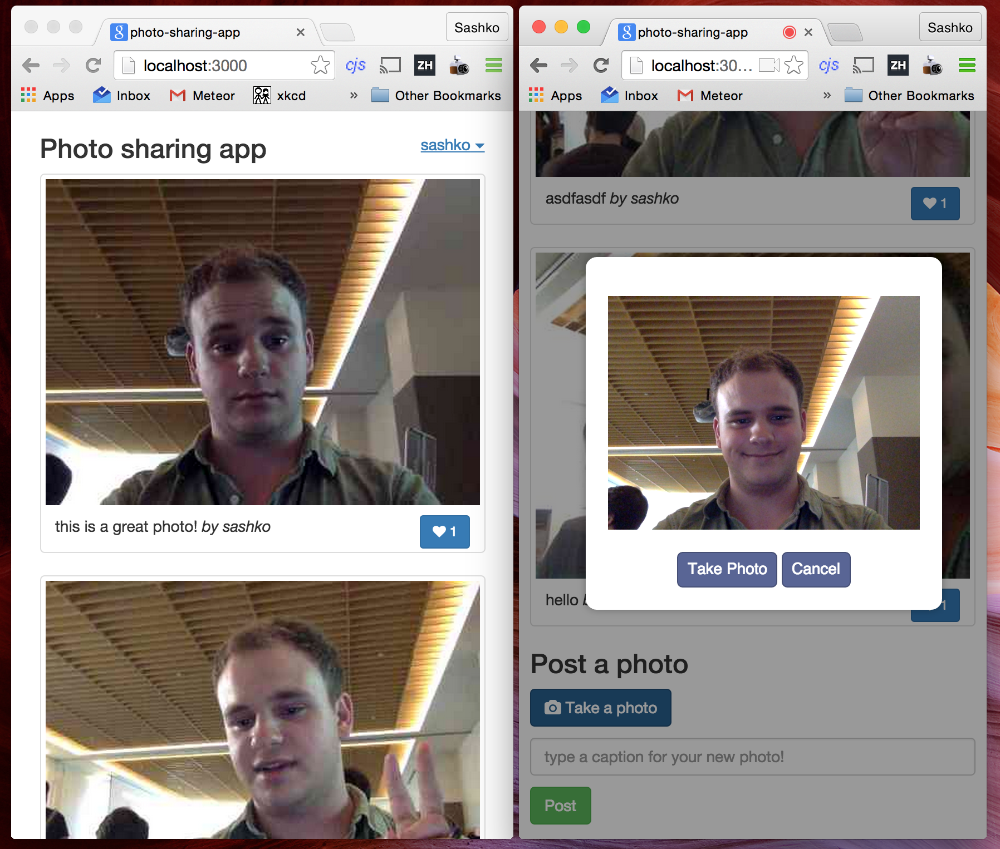

# Meteor photo sharing app demo

A simple photo sharing app we will build at the workshop for the NYUAD hackathon.

The app includes taking and uploading photos to a realtime stream, and the ability to like photos!

### Running the app

1. [Install Meteor (takes 5 minutes)](https://www.meteor.com/install)
2. Clone this repository from GitHub
3. Go into the app directory in your terminal and type `meteor`

### Screenshot

